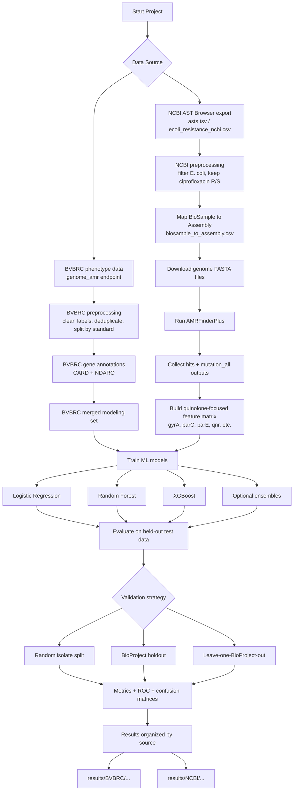

# Project Pipeline Mermaid Diagram

## Notes

- The original project started with the BVBRC workflow.
- The current ciprofloxacin-focused analysis emphasizes the NCBI plus AMRFinder workflow.
- The stricter validation path uses BioProject-aware splitting to test generalization beyond a simple random isolate split.
